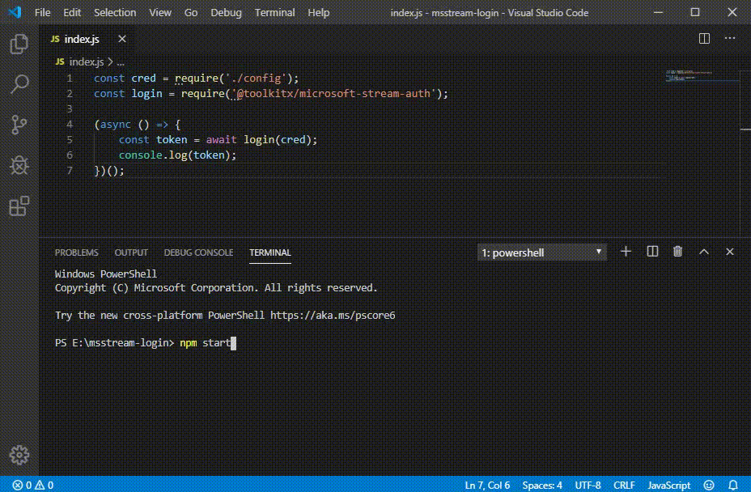

# Microsoft Streams Video Downloader

This downloads Microsoft Streams videos for a list of users, and saves the meta data and video files in the `output` directory.

## Get Started
Update `config.js` with your credentials and list of user UUIDs whose videos to download:
```javascript
module.exports = {
    account: 'myemail@domain.com',
    pwd: 'abcdef',
    userUuids: [
        'user1-uuid',
        'user2-uuid',
    ]
}
```

Then, run the script
```bash
# via docker
docker build -t mstream:latest .
./mstream.sh

```

or
```bash
# via node
npm install
npm run start
```

The files will be saved to the `output` directory
```
output/
    user1-uuid/
        videos.json
        videos/
            user1-video1-uuid-and-video-name.mp4
            user1-video2-uuid-and-video-name.mp4
            user1-video3-uuid-and-video-name.mp4
            user1-video4-uuid-and-video-name.mp4
    user2-uuid/
        videos.json
        videos/
            user2-video1-uuid-and-video-name.mp4
            user2-video2-uuid-and-video-name.mp4
            user2-video3-uuid-and-video-name.mp4
            user2-video4-uuid-and-video-name.mp4
```

## Notes

This tool will detect files that have already been downloaded and skip downloading those again. So, it is okay to run to multiple times to continue downloading and it'll pick up from where it left off.

When a video is downloading, it will be saved with `.tmp` extension. When the download is finished, it'll be renamed to the properly name. `.tmp` files are deleted when re-running the tool to download a file.

Video files are downloaded serially. There is room for improvement if parallelization is needed.

## Questions

Video files are assumped to be MP4. Is this correct?

---

## Old README content

## @toolkitx/microsoft-stream-auth

 [](https://badge.fury.io/js/%40toolkitx%2Fmicrosoft-stream-auth)

A **temporary**, **light-weight**, **high-performance** solution to get access token of Microsoft Stream without any browser technologies like Chrome/Selenium.

Why you need this? Accroading to the Office 365 roadmap, Microsoft doesn't provide any public APIs to access the Stream videos event you add API permissions to your app. So with the token get by `microsoft-stream-auth`, you can access the internal API of Stream, like upload video, download video etc.



### How it works

The `microsoft-stream-auth` go through the login flow by sending HTTP requests. It means it might not work in the feature.

### Installation

```bash
npm install @toolkitx/microsoft-stream-auth
```

### Simple to use

```javascript
const streamAuth = require('@toolkitx/microsoft-stream-auth');
const result = await streamAuth({account: 'User Account', pwd: 'User Password'});
```

Then you will get below object:

```json
{
    "accessToken": "eyJ0eXAiOiJKV1QiLCJhbGciOiJSUzI1NiIsIng1dC....",
    "apiGatewayUri": "https://aaea-1.api.microsoftstream.com/api/",
    "apiGatewayVersion": "1.3-private",
    "accessTokenExpiry": "2019-12-09T08:19:25.6166735+00:00"
}
```

### How to run test

1. Set your account and password in test/config.js
2. Run below command:
```bash
npm test
```

### Enjoy!
